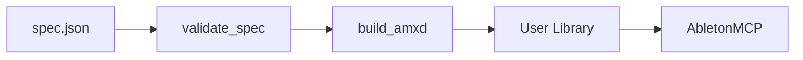

# Roadmap

Phased improvements for the M4L pipeline. **Phase 1** is implemented in-repo; **Phase 2–3** are planned.

## Architecture

M4L devices are **Max patchers** inside **`.amxd`**, running only in **Ableton Live**. The pipeline edits patcher JSON and automates Live via **AbletonOSC** + **patched AbletonMCP**.

## Phase 1 — Agent ergonomics (done)

| Item | Status |
|------|--------|
| [`tooling/spec.schema.json`](../tooling/spec.schema.json) + [`scripts/validate_spec.py`](../scripts/validate_spec.py) | Done |
| Wired into `m4l_pipeline` `all`/`build`, `./run`, CI | Done |
| [`tooling/templates/`](../tooling/templates/) + [`scripts/scaffold_plugin.py`](../scripts/scaffold_plugin.py) | Done |
| [`scripts/export_spec_from_amxd.py`](../scripts/export_spec_from_amxd.py) + [`MAX_TO_SPEC.md`](MAX_TO_SPEC.md) | Done |
| [`docs/AGENT_TOOLS.md`](AGENT_TOOLS.md) + [`AGENTS.md`](../AGENTS.md) tools | Done |
| Multi-IDE docs + Cursor rules + [`CLAUDE.md`](../CLAUDE.md) + Copilot instructions | Done — [`AGENTIC_IDES.md`](AGENTIC_IDES.md) |
| `build_adv` via `--with-adv` / `M4L_BUILD_ADV` | Done |
| Stricter UI check when `openinpresentation` ≠ 0 | Done |
| Pinned upstream archive refs (documented) | Done |

## Phase 2 — Quality loop (needs Live)

| Item | Approach | Status |
|------|----------|--------|
| Generalize `m4l_verify` | `--device-type`, `--spec` | Planned |
| Parameter sweep | OSC set/get on loaded device | Planned |
| Audio smoke test | Manual doc first, automate later | Planned |
| Presentation overlap linter | `presentation_rect` geometry | Planned |

**CI:** GitHub Actions stays **without Live** — validate + `build` only. Full verify on a machine with Live open.

## Phase 3 — Automation (optional)

| Item | Status |
|------|--------|
| `@cursor/sdk` example runner (`examples/sdk-run-setup/`) | Planned |
| [Ableton maxdevtools](https://github.com/Ableton/maxdevtools) for contributor `git diff` on `.amxd` | Documented in CONTRIBUTING |
| Self-hosted Live runner | Out of scope for public repo |

## Can vs cannot

| Can | Cannot |
|-----|--------|
| Spec-first build from JSON | Headless Max.app Save As |
| Export `.amxd` → spec (in-repo parser) | Edit open device patch via MCP |
| MCP load + OSC parameter checks | Guaranteed audio/DSP correctness in CI |
| Templates + workspace scaffold | gen~ / RNBO codegen without templates |
| Max-first hybrid (export → spec → pipeline) | VST/AU build |

## Upstream dependencies

| Repo | Install | Notes |
|------|---------|-------|
| [ideoforms/AbletonOSC](https://github.com/ideoforms/AbletonOSC) | ZIP → User Library Remote Scripts | Pin in [`ableton_bootstrap_common.py`](../scripts/ableton_bootstrap_common.py) |
| [ahujasid/ableton-mcp](https://github.com/ahujasid/ableton-mcp) | ZIP + **local patches** | `create_audio_track`, `user_library` URI |

Override with `BOOTSTRAP_ABLETON_OSC_ARCHIVE` / `BOOTSTRAP_ABLETON_MCP_ARCHIVE`.
