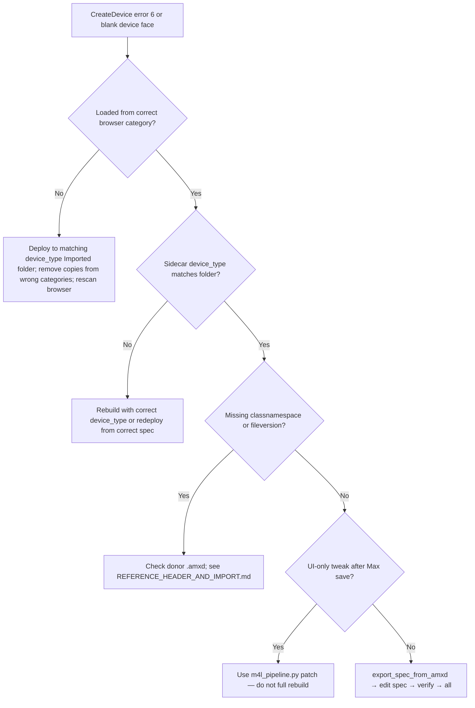

# Troubleshooting Max for Live pipeline devices

Symptoms and fixes when a device fails to open in Live or shows a blank rack face.

## CreateDevice error 6: Device file broken



### Wrong User Library category (most common)

Live chooses the M4L **wrapper class** from the **browser folder**, not from the `.amxd` blob alone.

| Spec `device_type` | Deploy / load from |
|--------------------|--------------------|
| `midi_effect` | **MIDI Effects → Max MIDI Effect → Imported** |
| `audio_effect` | **Audio Effects → Max Audio Effect → Imported** |
| `instrument` | **Instruments → Max Instrument → Imported** |

**Fix:** Remove stray copies under the wrong categories, redeploy with:

```bash
./venv/bin/python tooling/m4l_pipeline.py deploy path/to/Device.amxd midi_effect
```

(Default deploy target is `Imported/` for the given `device_type`.)

### Sidecar mismatch

Each built `.amxd` gets a sibling `Device.device_type` file (one line: `midi_effect`, etc.). Deploy and load check this before copying or calling AbletonMCP.

**Fix:** Rebuild from a spec with the correct `device_type`, or redeploy with the matching type argument.

### Missing donor fields

If `classnamespace` or `fileversion` is missing from the JSON, Max rejects the file. Use in-repo donors under `tooling/donors/` — see [`REFERENCE_HEADER_AND_IMPORT.md`](REFERENCE_HEADER_AND_IMPORT.md).

### UI-only edit after Max save

Full `build_amxd` replaces JSON and may drop trailing embeds and stamp a different `appversion`. For presentation tweaks (background color, title text):

```bash
./venv/bin/python tooling/m4l_pipeline.py patch device.amxd --bgcolor 0,0,0,1 --deploy midi_effect
```

See [`MAX_TO_SPEC.md`](MAX_TO_SPEC.md) for round-trip workflows.

## Deploy vs load paths

- **`m4l_pipeline.py all`** and **`build_deploy_load`** deploy to **`Imported/`** only (correct for MCP load).
- **`deploy`** CLI defaults to **`Imported/`** as well. Pass **`--category-root`** only if you intentionally want the category folder (rare; doubles browser entries).

## Related docs

- [`AGENT_TOOLS.md`](AGENT_TOOLS.md) — commands
- [`VERIFICATION_TIERS.md`](VERIFICATION_TIERS.md) — what CI vs Live verify
- [`PRIVATE_PLUGINS.md`](PRIVATE_PLUGINS.md) — keeping personal work out of git
